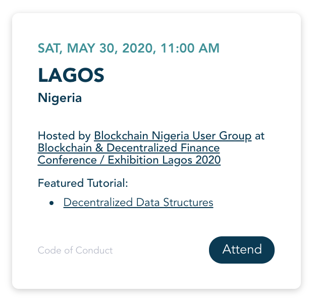

# Community Model Update (March 2020)

Based on the results of our Local Leadership Survey at the end of 2019, we are excited to announce updates to the ProtoSchool local leadership model designed to meet the needs of present and future local event organizers. The new event-based community model is documented in [README.md](./README.md), and this page provides some additional context for those who previously led ProtoSchool chapters under the old chapter-based model.

## Transitioning from a chapter-based model to an event-based model
As of March 2020, we have moved from a chapter-based community model to an event-based model to
create a more scalable system that encourages ProtoSchool content to be presented
either one-off or embedded in a variety of existing educational groups,
with a lower barrier to entry for event leaders. We'll no longer limit the number of groups in a city that can host ProtoSchool content. We expect these changes to lead to an increase in the number of ProtoSchool workshops hosted and the number of learners discovering our content through a variety of community groups around the globe.

## What this means for learners
Learners can now find all upcoming ProtoSchool workshops listed on our [events page](https://proto.school/#/events). These may include  workshops hosted by Meetup groups, attached to conferences, or presented as standalone events. Each event listing includes links to the event's registration page and Code of Conduct. It also includes a link to learn more about the organization hosting the event, as an opportunity to discover non-ProtoSchool content they might also offer. If the event is co-located with a conference, there's also a link to learn more about the broader conference.



With this new model, learners now see events hosted by a broader variety of groups in their region, and they no longer run the risk of discovering an inactive group when following a link from our chapters page to a chapter repository. However, our [archived chapter listings](https://proto.school/#/chapters) will remain accessible through the end of April.

## What this means for event organizers
The new event-based model creates a lower barrier to entry for local event leaders. If you're looking to host ProtoSchool workshops, you no longer need to apply to start a chapter. Simply review the [event guidelines](./README.md#protoschool-workshops) and [submit your qualifying event](https://forms.gle/t1iEzpQAFSYHhpBr9) for inclusion on our website. We'll check your links thoroughly to ensure the event meets our guidelines and then add it to our new [events page](https://proto.school/#/events).

Local leaders may incorporate ProtoSchool workshops based on our tutorials into the curriculum of an existing educational group or may host a one-off ProtoSchool workshop at a conference or campus event. There's no commitment to hosting multiple events over time, although we expect that including our content in longstanding Meetups will continue to be the most common approach. **Learn more about the [many models of event leadership](./README.md#hosting-protoschool-workshops) that can incorporate ProtoSchool workshops.**

### The ProtoSchool name applies to content, not groups
With this move away from the chapter model, **the ProtoSchool name now refers only to events that meet our [event guidelines](./README.md#event-guidelines) and teach our [tutorial content](https://proto.school/#/tutorials)**, regardless of who hosts them. It will **no longer be used to apply to the groups hosting those events** (formerly known as ProtoSchool chapters), and we'll no longer limit the number of groups in a city that can host ProtoSchool workshops.

If you run a group that sometimes leads ProtoSchool workshops and sometimes teaches other content, that's great! In fact, our survey showed that it's our most common approach to local event leadership, and the new event-based model supports it. Moving forward, you'll need to submit only those events focused on ProtoSchool for inclusion on our site, and you can refer to those as ProtoSchool workshops when you announce them. **Your group name and your announcements for other events that don't meet our guidelines shouldn't reference ProtoSchool**.

### Use the tools that work best for your group (GitHub no longer required)
In the chapter-based model, all local leaders had to set up a new GitHub repo to manage their chapter business. As we discovered in the Local Leadership Survey, this placed an unnecessary burden on the majority of our local leaders, doubling the work of groups that already had systems that worked well for them, like a Meetup group or discussion boards on other platforms. While some groups appreciate GitHub repos as a tool for communicating with community members or sharing presentation resources, the survey results showed that hosting those repos under the ProtoSchool organization wasn't essential.

Under the new event-based model, you should feel free to use whatever systems best meet the needs of your group or event. When you submit an event for inclusion on our website, you'll be able to provide links to whatever registration system and group or conference websites work best for you.

#### Phasing out chapter listings and chapter repos
The chapter repos required by the old system are no longer needed. However, **we'll continue to host an [archived version of our chapter listings](https://proto.school/#/chapters) through the end of April**, ensuring that learners can continue to discover your chapter repo through that link until then and that you'll have sufficient time to decide what tools you'd like to use moving forward.

As always, if you prefer that your chapter listing link to a website for your group instead of your GitHub repo, you may submit a pull request to the [ProtoSchool website repo](https://github.com/ProtoSchool/protoschool.github.io) to update your listing in the [`chapters.json`](https://github.com/ProtoSchool/protoschool.github.io/blob/code/src/static/chapters.json) file, found at `src/static/chapters.json`. Adding a `website` field with a valid URL to your JSON object will cause your chapter listing to link to the website provided instead of to the URL listed in the `repo` field. For example:

```json
{
  "name": "ProtoSchool San Francisco",
  "city": "San Francisco, CA",
  "country": "US",
  "region": "North America",
  "organizers": ["mikeal"],
  "website": "https://www.meetup.com/dweb-san-francisco/",
  "repo": "http://github.com/protoschool/san-francisco",
  "twitter": "sfprotoschool"
}
```
After April, the chapters page will be removed from our website and learners will discover your group exclusively through our [events page](https://proto.school/#/events). (We'll provide a redirect for any visitors looking for the old chapters page.)

**At the end of April, chapter repos in the ProtoSchool GitHub organization will either be archived or have their ownership transferred, based on your preference:**

- **If you enjoy using GitHub** as a way to communicate with your community members, we'll be happy to [transfer ownership of your repository](https://help.github.com/en/github/administering-a-repository/transferring-a-repository) to another GitHub user or organization account so that you continue to use it for group communication. Links to the repo will be automatically redirected by GitHub. **Please [email us](mailto:protoschool@protocol.ai) before April 30 if you would like us to transfer ownership of your repository.**

- **If using GitHub doesn't serve your needs**, or if we don't hear from you by April 30 to request an ownership transfer, we will [archive your repository](https://help.github.com/en/github/creating-cloning-and-archiving-repositories/archiving-repositories) on May 1, which will make it read-only for all users (including you) and indicate that it's no longer actively maintained. We strongly encourage you to take the time before then to add messaging yourself to point visitors to the resources you've chosen to use for your group instead of the GitHub repo: your group website, Code of Conduct, event listings, etc. -- whatever tools you find most convenient! However, if you haven't left your own message before the archiving date arrives, we'll add a default message to your repository's README.md noting the change to our community model and encouraging visitors to view our event listings to look for upcoming ProtoSchool workshops hosted by your group.

### Subscribe to our newsletter for ProtoSchool updates
Until now, with GitHub use as a requirement for event organizers, we've been communicating with local leaders exclusively through GitHub using issues in our `organizing` repo or your chapter repo. We don't have organizers' email addresses, which presents a communication challenge.

Moving forward, we'll be using an email newsletter to share ProtoSchool updates. Most subscribers to the newsletter will only receive updates announcing new ProtoSchool tutorials or features, and we'd love for you to encourage your event attendees to sign up for this news. However, subscribers may optionally sign up for local leadership updates, where we'll share tips and resources for hosting events.

We'll automatically sign you up for local leadership updates when you submit a workshop for inclusion on our website. However, if you don't have an event coming up in the near future, you can subscribe now via our [newsletter signup form](https://school.us4.list-manage.com/subscribe?u=41e9e493c56c3865870435d91&id=967f7cf514). (Be sure to check the "Local Leadership Updates" box.)

### Continue to find resources and discussions in our `organizing` repo
While you'll no longer receive notifications of local leadership updates through GitHub, we'll continue to use the `organizing` repo as a place to host [event resources](./RESOURCES.md)  (template slide decks, logo files, instructions for ordering stickers, etc.) and to encourage discussion amongst local leaders via issues. Be sure to watch this repo if you'd like to be notified of discussions amongst your fellow event organizers.

## Questions?
If you have questions on ProtoSchool's new event-based communtiy model or what qualifies as a ProtoSchool workshop, please feel free to [email the project maintainers](mailto:protoschool@protocol.ai). We'll continue to update this transition guide based on the questions you share with us.

## License
ProtoSchool is licensed under the Apache-2.0 and MIT licenses. See [LICENSE.md](./LICENSE.md) for further detail.
